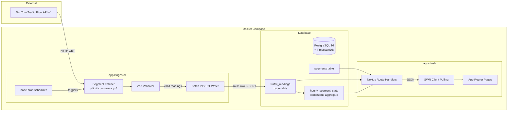

# Design Document: ORR Pulse

## Overview

ORR Pulse is a real-time traffic monitoring dashboard for Bengaluru's Outer Ring Road (Silk Board → KR Puram). The system is structured as three cooperating services inside a monorepo:

1. **Ingestor** — A Node.js worker that polls the TomTom Traffic Flow API every 15 minutes, validates responses, computes congestion indices, and batch-inserts readings into TimescaleDB.
2. **API Server** — Next.js 14 route handlers serving aggregated traffic data (live corridor, heatmap, segment history, commute recommendations) with appropriate caching.
3. **Dashboard** — A Next.js 14 App Router frontend rendering dark-themed visualizations (corridor strip, heatmap, trend charts, recommendation cards) with SWR auto-refresh.

Data flows uni-directionally: TomTom API → Ingestor → PostgreSQL/TimescaleDB → API Server → Dashboard.

## Architecture



### Key Design Decisions

| Decision | Rationale |
|----------|-----------|
| TimescaleDB hypertable | Automatic time-based partitioning gives consistent query performance as data grows; continuous aggregates eliminate expensive GROUP BY on reads |
| p-limit concurrency=3 | Respects TomTom rate limits while keeping total poll cycle under 2 minutes |
| SWR with 60s revalidation | Balances freshness against API load; stale-while-revalidate gives instant page loads |
| Shared package for segments | Single source of truth prevents drift between ingestor/API; TypeScript literal types catch invalid segment IDs at compile time |
| 90-day retention policy | Keeps DB size bounded (~3.6M rows/year for 10 segments at 15-min intervals) while retaining enough history for 4-week rolling median |
| Role separation (ingestor_rw / web_ro) | Least-privilege principle; compromised web layer cannot modify data |

## Components and Interfaces

### packages/shared

```typescript
// segments.ts
export const SEGMENT_IDS = [
  'silk-board', 'hsr', 'ibblur', 'bellandur', 'ecospace',
  'kadubeesanahalli', 'marathahalli', 'doddanekundi', 'mahadevapura', 'kr-puram'
] as const;

export type SegmentId = typeof SEGMENT_IDS[number];

export interface SegmentConfig {
  id: SegmentId;
  name: string;
  lat: number;
  lon: number;
  position: number; // 0-indexed sequential order
}

export const SEGMENTS: SegmentConfig[];

// schemas.ts — Zod schemas for TomTom response and internal models
export const tomtomResponseSchema: ZodSchema;
export const trafficReadingSchema: ZodSchema;

// types.ts — shared response types
export interface TrafficReading { ... }
export interface HeatmapCell { ... }
export interface CommuteWindow { ... }
export interface CorridorStatus { ... }

// congestion.ts
export function computeCongestionIndex(currentSpeed: number, freeFlowSpeed: number): number;
```

### apps/ingestor

| Module | Responsibility |
|--------|---------------|
| `src/index.ts` | Entry point; sets up cron job, registers SIGTERM handler |
| `src/poller.ts` | Orchestrates a single poll cycle: fetch → validate → filter → write |
| `src/fetcher.ts` | HTTP client for TomTom API with timeout (10s), retry (3×, exponential), concurrency limit |
| `src/validator.ts` | Zod parse + CI computation + confidence filter (≥0.5) |
| `src/writer.ts` | Builds and executes batched multi-row INSERT |
| `src/db.ts` | pg Pool configuration using `ingestor_rw` role |
| `src/logger.ts` | pino logger instance |

### apps/web — Route Handlers

| Endpoint | Cache | Source |
|----------|-------|--------|
| `GET /api/corridor/now` | 60s `s-maxage` | `DISTINCT ON (segment_id) ORDER BY time DESC` on `traffic_readings` |
| `GET /api/heatmap?days=7` | 30min `s-maxage` | `hourly_segment_stats` grouped by `EXTRACT(dow)` and `EXTRACT(hour)` |
| `GET /api/segments/:id/history?hours=48` | 5min `s-maxage` | Raw `traffic_readings WHERE segment_id = $1 AND time > NOW() - interval` |
| `GET /api/recommendations?from=&to=` | 30min `s-maxage` | Rolling 4-week median from `hourly_segment_stats`, percentile_cont(0.5) |

### apps/web — Frontend Components

| Component | Description |
|-----------|-------------|
| `CorridorStrip` | Custom SVG showing 10 segments as color-coded blocks with CI overlay |
| `Heatmap` | 24×7 grid (hours × days) with CI color ramp cells and hover tooltips |
| `SegmentTrend` | Recharts `LineChart` for multi-segment CI comparison |
| `BestWindowCard` | Card showing best/worst commute windows for today |
| `LiveBadge` | Pulsing indicator showing last update timestamp |
| `SegmentDetail` | Full page: 48-hour chart + metadata for `/segments/[id]` |

### Interface Contracts

```typescript
// GET /api/corridor/now response
interface CorridorNowResponse {
  segments: Array<{
    id: SegmentId;
    name: string;
    currentSpeed: number;
    freeFlowSpeed: number;
    congestionIndex: number;
    currentTravelTime: number;
    freeFlowTravelTime: number;
    confidence: number;
    roadClosure: boolean;
    timestamp: string; // ISO 8601
  }>;
  updatedAt: string;
}

// GET /api/heatmap response
interface HeatmapResponse {
  matrix: Array<{
    dayOfWeek: number; // 0=Monday, 6=Sunday
    hour: number;      // 0–23
    avgCongestionIndex: number;
  }>;
  days: number;
  generatedAt: string;
}

// GET /api/segments/:id/history response
interface SegmentHistoryResponse {
  segmentId: SegmentId;
  readings: Array<{
    time: string;
    currentSpeed: number;
    freeFlowSpeed: number;
    congestionIndex: number;
    currentTravelTime: number;
    freeFlowTravelTime: number;
    confidence: number;
    roadClosure: boolean;
  }>;
  hours: number;
}

// GET /api/recommendations response
interface RecommendationsResponse {
  recommendations: Array<{
    dayOfWeek: number;
    dayName: string;
    best: CommuteWindow;
    worst: CommuteWindow;
  }>;
  from: SegmentId;
  to: SegmentId;
}

interface CommuteWindow {
  startHour: number;
  endHour: number;
  avgCongestionIndex: number;
}
```

## Data Models

### PostgreSQL Schema

```sql
-- Segments reference table
CREATE TABLE segments (
  id TEXT PRIMARY KEY,
  name TEXT NOT NULL,
  lat DOUBLE PRECISION NOT NULL,
  lon DOUBLE PRECISION NOT NULL,
  position INTEGER NOT NULL UNIQUE
);

-- Traffic readings hypertable
CREATE TABLE traffic_readings (
  time TIMESTAMPTZ NOT NULL,
  segment_id TEXT NOT NULL REFERENCES segments(id),
  current_speed DOUBLE PRECISION NOT NULL,
  free_flow_speed DOUBLE PRECISION NOT NULL,
  current_travel_time DOUBLE PRECISION NOT NULL,
  free_flow_travel_time DOUBLE PRECISION NOT NULL,
  confidence DOUBLE PRECISION NOT NULL,
  congestion_index DOUBLE PRECISION NOT NULL,
  road_closure BOOLEAN NOT NULL DEFAULT FALSE
);

SELECT create_hypertable('traffic_readings', 'time');

-- Continuous aggregate for hourly rollups
CREATE MATERIALIZED VIEW hourly_segment_stats
WITH (timescaledb.continuous) AS
SELECT
  time_bucket('1 hour', time) AS bucket,
  segment_id,
  AVG(congestion_index) AS avg_ci,
  MAX(congestion_index) AS max_ci,
  AVG(current_speed) AS avg_speed,
  COUNT(*) AS sample_count
FROM traffic_readings
GROUP BY bucket, segment_id;

-- 90-day retention policy
SELECT add_retention_policy('traffic_readings', INTERVAL '90 days');

-- Access roles
CREATE ROLE ingestor_rw;
GRANT INSERT ON traffic_readings TO ingestor_rw;
GRANT SELECT ON segments TO ingestor_rw;

CREATE ROLE web_ro;
GRANT SELECT ON traffic_readings, segments, hourly_segment_stats TO web_ro;
```

### Data Volume Estimates

| Metric | Value |
|--------|-------|
| Readings per day | 10 segments × 96 polls = 960 |
| Readings per 90 days | ~86,400 |
| Hourly aggregate rows per day | 10 × 24 = 240 |
| Aggregate rows per 90 days | ~21,600 |

### Zod Validation Schema (shared)

```typescript
import { z } from 'zod';

export const tomtomFlowSegmentSchema = z.object({
  flowSegmentData: z.object({
    currentSpeed: z.number().positive(),
    freeFlowSpeed: z.number().positive(),
    currentTravelTime: z.number().nonnegative(),
    freeFlowTravelTime: z.number().nonnegative(),
    confidence: z.number().min(0).max(1),
    roadClosure: z.boolean(),
  }),
});

export type TomTomFlowSegment = z.infer<typeof tomtomFlowSegmentSchema>;
```


## Correctness Properties

*A property is a characteristic or behavior that should hold true across all valid executions of a system — essentially, a formal statement about what the system should do. Properties serve as the bridge between human-readable specifications and machine-verifiable correctness guarantees.*

### Property 1: Concurrency never exceeds limit

*For any* set of segments to poll (regardless of count or response timing), the number of in-flight HTTP requests at any point during a poll cycle shall never exceed 3.

**Validates: Requirements 1.2**

### Property 2: Retry respects exponential backoff

*For any* sequence of API failures for a segment, the fetcher shall retry at most 3 times with delays matching the exponential backoff schedule (1s, 4s, 16s), and if all retries fail, the segment reading is skipped without crashing the poll cycle.

**Validates: Requirements 1.4**

### Property 3: Confidence filter preserves only high-confidence readings

*For any* Traffic_Reading with confidence < 0.5, the reading shall be discarded; for any reading with confidence ≥ 0.5, the reading shall be preserved for persistence. The filter shall never alter the content of readings it keeps.

**Validates: Requirements 1.5**

### Property 4: Zod schema validation accepts valid and rejects invalid payloads

*For any* object conforming to the TomTom flow segment response schema, Zod parse shall succeed and return the expected typed object. For any object missing required fields or containing fields with invalid types, Zod parse shall fail.

**Validates: Requirements 2.1, 2.2**

### Property 5: Congestion Index computation correctness

*For any* pair of positive numbers (currentSpeed, freeFlowSpeed), `computeCongestionIndex(currentSpeed, freeFlowSpeed)` shall equal `1 - (currentSpeed / freeFlowSpeed)`. The result shall be clamped to [0, 1].

**Validates: Requirements 2.3**

### Property 6: Corridor now returns only the latest reading per segment

*For any* set of traffic readings in the database (with varying timestamps per segment), the `/api/corridor/now` query logic shall return exactly one reading per segment, and that reading shall have the maximum timestamp for that segment.

**Validates: Requirements 4.1, 4.2**

### Property 7: Heatmap aggregation correctness

*For any* set of hourly_segment_stats rows within the requested day range, the heatmap computation shall return the correct arithmetic mean of congestion_index values grouped by (hour-of-day, day-of-week), averaging across all segments.

**Validates: Requirements 5.1**

### Property 8: Segment history returns only readings within the time window

*For any* segment ID and requested hours parameter, all returned readings shall have timestamps within [now - hours, now], and no reading within that window shall be omitted.

**Validates: Requirements 6.1**

### Property 9: Invalid segment identifiers produce error responses

*For any* string that is not one of the 10 predefined segment IDs, requests to `/api/segments/:id/history` shall return HTTP 404, and requests to `/api/recommendations` with invalid `from` or `to` shall return HTTP 400.

**Validates: Requirements 6.3, 7.4**

### Property 10: Recommendation windows identify correct best and worst periods

*For any* 4-week dataset of hourly congestion values, the recommendation algorithm shall compute the rolling median per (segment, day-of-week, hour), average across the corridor, and correctly identify the hour window with minimum median CI (best) and maximum median CI (worst) for each day of the week.

**Validates: Requirements 7.1, 7.2**

### Property 11: Sub-corridor filtering includes only segments in range

*For any* valid `from` and `to` segment pair where `from.position <= to.position`, the recommendation computation shall include only segments whose position is >= from.position and <= to.position.

**Validates: Requirements 7.3**

### Property 12: CI color ramp mapping correctness

*For any* congestion index value in [0, 1], the color mapping function shall return green for CI in [0, 0.3), amber for CI in [0.3, 0.6), and red for CI in [0.6, 1.0].

**Validates: Requirements 8.2, 9.2**

## Error Handling

### Ingestor Error Handling

| Error Scenario | Handling Strategy |
|----------------|------------------|
| TomTom API timeout (>10s) | AbortController aborts request; treated as failed attempt triggering retry |
| TomTom API HTTP error (4xx/5xx) | Retry up to 3× with exponential backoff; log error with segment ID |
| All retries exhausted for a segment | Skip segment for this cycle; log warning; other segments proceed normally |
| Zod validation failure | Log validation error with segment ID and raw payload summary; discard reading |
| Database connection failure | Log critical error; allow pg Pool auto-reconnect on next cycle |
| Database INSERT failure | Log error with batch details; no partial retry (entire batch fails) |
| SIGTERM received during poll | Set shutdown flag; wait for in-progress cycle to complete (up to 30s timeout); exit 0 |
| Unexpected exception in poll cycle | Catch at top-level; log error with stack trace; cron continues scheduling next cycle |

### API Server Error Handling

| Error Scenario | Handling Strategy |
|----------------|------------------|
| Invalid segment ID in path/query | Return 400 or 404 with JSON error: `{ error: string, code: string }` |
| Invalid query parameters | Return 400 with validation details |
| Database query timeout | Return 503 with retry-after header |
| Database connection failure | Return 503; Next.js will serve stale cache if available |
| Empty result set | Return 200 with empty arrays (not an error) |
| Internal error | Return 500 with generic error message; log details server-side |

### Frontend Error Handling

| Error Scenario | Handling Strategy |
|----------------|------------------|
| API fetch failure | SWR shows stale data with error indicator; LiveBadge shows "stale" state |
| Invalid segment in URL | Next.js notFound() → 404 page |
| Empty data (no readings yet) | Show skeleton/placeholder UI with "Waiting for data" message |
| Component render error | React Error Boundary per section; failed section shows fallback without crashing page |

## Testing Strategy

### Unit Tests (Vitest)

Test the pure logic layer in isolation:

| Module | Test Focus |
|--------|-----------|
| `packages/shared/congestion.ts` | CI computation (Property 5) — property-based |
| `packages/shared/schemas.ts` | Zod validation (Property 4) — property-based |
| `packages/shared/segments.ts` | Segment config completeness, type exports |
| `apps/ingestor/src/fetcher.ts` | Retry logic (Property 2), timeout, concurrency (Property 1) — property-based |
| `apps/ingestor/src/validator.ts` | Confidence filter (Property 3) — property-based |
| `apps/web/lib/color.ts` | CI-to-color mapping (Property 12) — property-based |
| `apps/web/lib/recommendations.ts` | Median computation, window identification (Property 10, 11) — property-based |
| `apps/web/lib/queries.ts` | Query builders, parameter validation (Property 9) — property-based |

### Property-Based Tests (Vitest + fast-check)

The project will use **fast-check** as the property-based testing library within Vitest.

**Configuration:**
- Minimum 100 iterations per property test (`numRuns: 100`)
- Each test tagged with comment referencing design property
- Tag format: `// Feature: orr-pulse, Property {N}: {title}`

**Properties to implement:**
1. Concurrency limit (Property 1)
2. Retry backoff (Property 2)
3. Confidence filter (Property 3)
4. Zod validation (Property 4)
5. CI computation (Property 5)
6. Latest reading per segment (Property 6)
7. Heatmap aggregation (Property 7)
8. Time-window filtering (Property 8)
9. Invalid segment error responses (Property 9)
10. Recommendation windows (Property 10)
11. Sub-corridor filtering (Property 11)
12. CI color ramp (Property 12)

### Integration Tests (Vitest + Dockerized TimescaleDB)

| Test Suite | Focus |
|-----------|-------|
| Ingestor → DB | Verify batch INSERT writes correct rows; verify confidence filter discards correctly |
| API /corridor/now | Seed data, verify DISTINCT ON returns latest per segment |
| API /heatmap | Seed hourly_segment_stats, verify matrix dimensions and values |
| API /segments/:id/history | Seed readings, verify time-window filtering |
| API /recommendations | Seed 4 weeks of data, verify best/worst windows against manual calculation |

### End-to-End Smoke Tests

| Test | Verification |
|------|-------------|
| Docker Compose up | All 3 services start and health-check pass |
| Seed + Dashboard render | After seeding, dashboard loads without errors |
| Ingestor poll cycle | After one cycle, verify readings appear in DB |

### Test Data Seeding

The seed script generates 14 days of synthetic data with:
- Morning peak (8–10 AM): CI 0.6–0.9
- Evening peak (5–7 PM): CI 0.5–0.8
- Off-peak: CI 0.1–0.3
- Weekends: 30% lower CI across all hours
- Random noise: ±0.05 CI per reading
- All 10 segments with slight position-based variation (downstream segments more congested during peaks)
